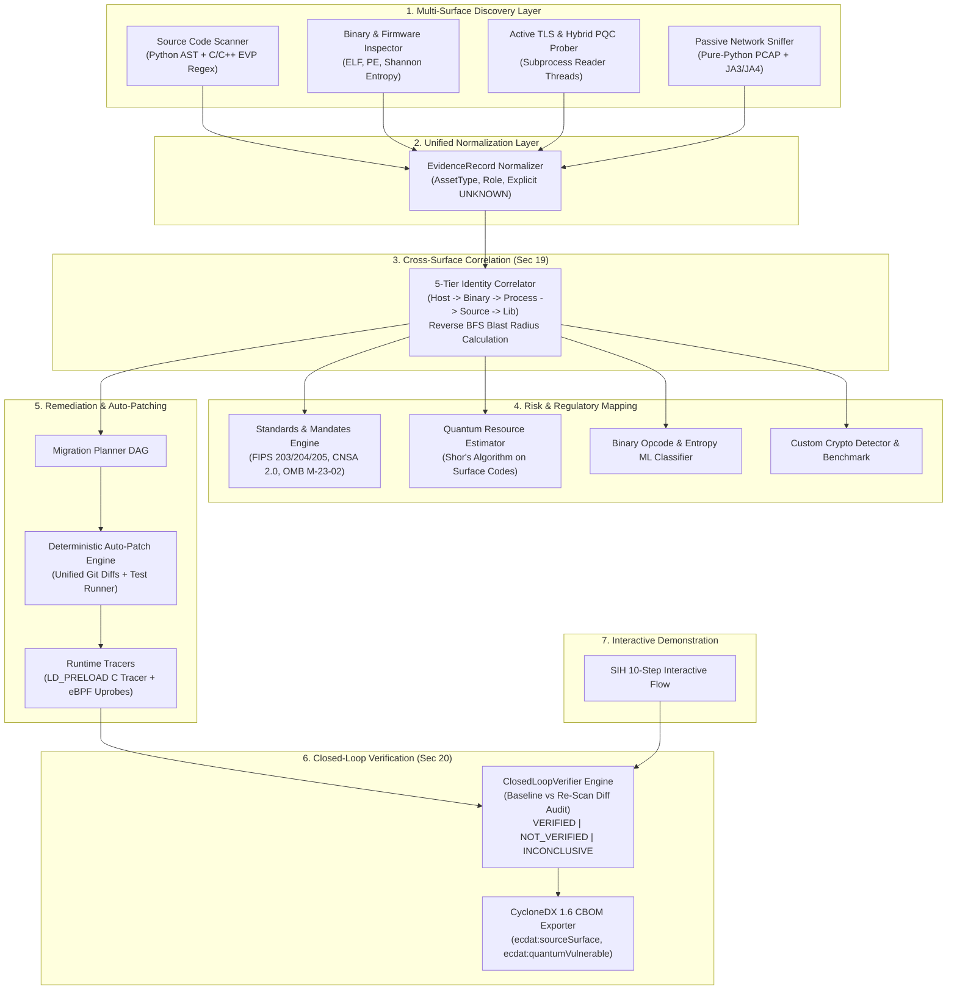

# ECDAT — Enterprise Cryptographic Discovery & Agility Toolkit
### Complete Implementation with Experimental Extensions, Closed-Loop Verification & Post-Quantum Migration

[](backend/tests)
[](frontend)
[](backend/tests/bom-1.6.schema.json)
[](backend/engine/standards_mapping.py)
[](backend/engine/standards_mapping.py)

---

## 1. Executive Summary & Problem Statement

Modern enterprise software systems rely on heterogeneous cryptographic primitives distributed across source code repositories, compiled binaries, container firmware, network edge load balancers, and third-party SaaS dependencies. 

With the standardization of Post-Quantum Cryptography (PQC) by NIST (FIPS 203 ML-KEM, FIPS 204 ML-DSA, FIPS 205 SLH-DSA in August 2024), government mandates (NSA CNSA 2.0, White House OMB M-23-02), and the imminent threat of **Harvest-Now, Decrypt-Later (HNDL)** attacks by nation-state adversaries, organizations face an urgent cryptographic inventory and migration challenge.

**ECDAT (Enterprise Cryptographic Discovery and Agility Toolkit)** is an end-to-end, multi-surface cryptographic observability, risk assessment, automated remediation, and closed-loop verification platform. ECDAT replaces ad-hoc grep scripts and synthetic dashboards with deterministic, evidence-backed discovery, formal cross-surface entity correlation, and mathematically grounded quantum resource estimations.

---

## 2. End-to-End System Architecture



---

## 3. Core Lifecycle & Engine Implementations

### 3.1 Unified Evidence Model (`backend/engine/evidence_model.py`)
All discovery mechanisms translate raw signals into immutable, structured `EvidenceRecord` dataclasses:
- **Taxonomies**:
  - `AssetType`: `ALGORITHM`, `KEY`, `CERTIFICATE`, `PROTOCOL`, `LIBRARY`.
  - `CryptographicRole`: `KEY_EXCHANGE`, `DIGITAL_SIGNATURE`, `BULK_ENCRYPTION`, `HASH_FUNCTION`, `MAC`, `RNG`.
  - `SourceSurface`: `SOURCE_CODE`, `COMPILED_BINARY`, `NETWORK_TLS`, `PASSIVE_PCAP`, `RUNTIME_TRACE`.
  - `EvidenceType`: `DETERMINISTIC_AST`, `HEURISTIC_REGEX`, `MEASURED_HANDSHAKE`, `BINARY_SIGNATURE`, `ENTROPY_ANALYSIS`.
- **Explicit Unknown Handling**: Rather than guessing unmeasured properties, ECDAT explicitly tags key lengths, curve parameters, and certificate depths as `UNKNOWN` when the scanner cannot confirm them.

### 3.2 5-Tier Cross-Surface Identity Correlation (`backend/engine/correlator.py`)
Implements Section 19 entity resolution:
1. **Identity Hierarchy**:
   $$\text{Host / Service} \longrightarrow \text{Binary / Artifact} \longrightarrow \text{Runtime Process} \longrightarrow \text{Source File} \longrightarrow \text{Cryptographic Library}$$
2. **Typed Edge Relationships**:
   - `uses`: A service or binary invoking a cryptographic algorithm.
   - `implements`: A library providing an algorithm primitive.
   - `serves`: A network host terminating a TLS protocol or certificate.
   - `authenticated_by`: A key pair or certificate authenticating an endpoint.
3. **Reverse BFS Blast Radius**: Traverses backward from any flagged vulnerable primitive to enumerate all dependent services, processes, and network endpoints that would fail or require re-certification if the primitive were disabled or rotated.

### 3.3 Closed-Loop Differential Verifier (`backend/engine/verifier.py`)
Implements Section 20 closed-loop verification:
- Computes mathematical set differentials between a pre-migration baseline evidence record set ($E_{\text{base}}$) and a post-migration re-scan ($E_{\text{post}}$):
  - $\text{Retired Weaknesses} = E_{\text{base}}^{\text{weak}} \setminus E_{\text{post}}$
  - $\text{Introduced Protections} = E_{\text{post}}^{\text{secure}} \setminus E_{\text{base}}$
  - $\text{Persisting Risks} = E_{\text{base}}^{\text{weak}} \cap E_{\text{post}}^{\text{weak}}$
  - $\text{Regressions} = (E_{\text{post}}^{\text{weak}} \setminus E_{\text{base}}^{\text{weak}}) \cup \text{Failed Functional Tests}$
- Generates strict, deterministic audit verdicts:
  - `VERIFIED`: All targeted weaknesses retired, no regressions, risk reduction $> 0\%$.
  - `NOT_VERIFIED`: Persisting risks remain or regressions introduced.
  - `INCONCLUSIVE`: Insufficient post-migration evidence collected.

### 3.4 Deepened C/C++ Scanner (`backend/engine/polyglot_scanner.py`)
- Enhanced AST/regex engine with comment-stripping parser.
- Targets OpenSSL EVP modern interfaces (`EVP_CIPHER_CTX_new`, `EVP_EncryptInit_ex`), Windows CNG (`BCryptEncrypt`, `BCryptGenRandom`), AES-GCM, and NIST PQC signatures (`ML-KEM-768`, `ML-DSA-65`).
- Precision fix: Scopes SHA-1 header checks strictly to `<openssl/sha1.h>` to avoid false positive regressions on modern `<openssl/sha.h>` (which defines SHA-256 and SHA-512).

### 3.5 CycloneDX 1.6 CBOM Enrichment (`backend/engine/cbom_generator.py`)
Exports CycloneDX 1.6 compliant Cryptographic Bill of Materials (CBOM) enriched with custom namespace properties:
- `ecdat:sourceSurface`
- `ecdat:evidenceType`
- `ecdat:quantumVulnerable`
- Validated directly against upstream `bom-1.6.schema.json`.

---

## 4. Complete Experimental Extensions (A through G)

| Extension | Module | Description | Technical Implementation |
| :--- | :--- | :--- | :--- |
| **A: Runtime LD_PRELOAD Tracer** | [`runtime_tracer.py`](backend/engine/runtime_tracer.py) | C shared library hook intercepting runtime crypto APIs | Compiles portable C source (`libecdat_tracer.so`) intercepting `EVP_EncryptInit_ex`, `RSA_public_encrypt`, `MD5_Init`, and `RAND_bytes`. Generates runtime event logs. |
| **B: eBPF / Uprobe Tracer** | [`ebpf_tracer.py`](backend/engine/ebpf_tracer.py) | Kernel uprobe tracing on user-space libraries | Generates Linux `bpftrace` scripts and raw eBPF C programs attaching to `/usr/lib/libcrypto.so.3` symbols. Includes safe unprivileged fallback simulation. |
| **C: Auto-Patching Engine** | [`patch_engine.py`](backend/engine/patch_engine.py) | Deterministic code transformation with regression tests | Pattern-based AST code refactoring (MD5 $\to$ SHA-256, RSA-1024 $\to$ RSA-3072/ML-KEM, DES $\to$ AES-256-GCM). Emits unified git diffs and differential test runners. |
| **D: Custom Crypto Detector** | [`custom_crypto_detector.py`](backend/engine/custom_crypto_detector.py) | Proprietary/obfuscated cipher detection with benchmark | Shannon entropy + loop-shift heuristics + LLM assistance (Ollama/OpenAI). Ships with an 8-sample evaluation benchmark suite reporting Precision, Recall, and F1. |
| **E: Passive PCAP Sniffer** | [`pcap_engine.py`](backend/engine/pcap_engine.py) | Zero-probe network discovery via packet capture | Pure-Python PCAP parser and TLS record dissector extracting ClientHello/ServerHello, cipher suites, curves, and computing JA3 and JA4 fingerprints. |
| **F: Quantum Resource Estimator** | [`quantum_estimator.py`](backend/engine/quantum_estimator.py) | Shor's algorithm surface code resource modeling | Mathematical formula calculating logical qubits, surface code distance $d$, physical qubits, and runtime hours citing Gidney & Ekerå (2021) and Roetteler et al. (2017). |
| **G: Deep Binary ML Classifier** | [`binary_classifier.py`](backend/engine/binary_classifier.py) | Statistical opcode density and entropy profiler | Sliding-window Shannon entropy, chi-square byte randomness distribution, and opcode density scoring (XOR, ROR/ROL, bitwise shifts). |

### Mathematical Model for Quantum Resource Estimation
For attacking RSA-$N$ (where $N = 2048$ or $3072$ bits) using Shor's algorithm:
$$\text{Logical Qubits} = 2N + 2$$
$$\text{Physical Error Rate } p = 10^{-3}, \quad \text{Code Distance } d = 2 \left\lceil \frac{\log(N_{\text{gates}} / P_{\text{target}})}{2 \log(p_{\text{th}} / p)} \right\rceil + 1 \approx 27$$
$$\text{Physical Qubits} = 2 \cdot (\text{Logical Qubits}) \cdot d^2 \approx 4.1 \times 10^6 \text{ physical qubits}$$
$$\text{Runtime Hours} = \frac{N_{\text{cycles}} \cdot \tau_{\text{cycle}}}{3600} \approx 8.2 \text{ hours (at } \tau = 1\,\mu\text{s)}$$
*No arbitrary calendar forecasts are made; all estimates are grounded in peer-reviewed quantum computing literature.*

---

## 5. Standards & Regulatory Mapping (`backend/engine/standards_mapping.py`)

ECDAT automatically correlates every discovered primitive to regulatory deadlines:
- **NIST FIPS 203 (ML-KEM)**: Module-Lattice Key Encapsulation Mechanism (ML-KEM-512, 768, 1024).
- **NIST FIPS 204 (ML-DSA)**: Module-Lattice Digital Signature Algorithm (ML-DSA-44, 65, 87).
- **NIST FIPS 205 (SLH-DSA)**: Stateless Hash-Based Digital Signature Algorithm.
- **NSA CNSA 2.0 Timelines**:
  - **2025**: Software & firmware updates must deprecate classical RSA/ECDSA.
  - **2030**: Systems mandate for PQC deployment across national security systems.
  - **2033**: Complete transition of all hardware and infrastructure.
- **White House OMB M-23-02**: Federal agency mandates for PQC migration inventory and vulnerability reporting.

---

## 6. End-to-End 10-Step Interactive SIH Demo Flow (`backend/engine/demo_flow.py`)

A fully integrated 1-click execution sequence demonstrating the complete lifecycle:
1. **Initial Multi-Surface Scan**: Ingests vulnerable code, legacy binary, and public TLS endpoints.
2. **Unified Evidence Extraction**: Normalizes 6 disparate findings into `EvidenceRecord` objects.
3. **Cross-Surface Identity Resolution**: Builds the 5-tier entity graph mapping host to code files.
4. **Blast-Radius & Risk Assessment**: Calculates downstream exposure and HNDL threat ratings.
5. **Dependency-Aware Migration Planning**: Generates phased transition roadmap.
6. **Automated Cryptographic Patching**: Applies deterministic git diff patches (MD5 $\to$ SHA-256, RSA $\to$ ML-KEM).
7. **Regression Test Execution**: Executes differential tests on the patched code.
8. **Post-Migration Re-Scan**: Re-probes the hardened services and codebases.
9. **Closed-Loop Differential Verification**: Audits baseline vs post-migration evidence and outputs `VERIFIED`.
10. **CycloneDX 1.6 CBOM Export**: Emits the final cryptographic bill of materials.

---

## 7. Frontend User Interface

Built with **Next.js 16.3.4 (Turbopack)**, **Tailwind CSS**, and **Lucide Icons**:

### 7.1 Dedicated Feature-Specific Scan History
Every scan workspace (`network`, `code`, `binary`) features a dedicated scan history and evidence panel directly below the scan form:
- **Network Scan Workspace**:
  - Displays **ONLY** network scans.
  - Interactive TLS 4-metric grid (TLS Version, Cipher Suite, Key Exchange Group, Server Endpoint).
  - Post-quantum threat banner with HNDL risk rating and FIPS 203 recommendation.
  - X.509 Certificate trust & validity details.
  - 1-Click Re-scan button (loads target back into form) and single-scan CBOM download.
- **Source Code Scan Workspace**:
  - Displays **ONLY** source code scans.
  - Findings list with algorithm name, severity badge, line number, and code snippet.
  - Direct post-quantum remediation guidance for each finding.
- **Binary & Firmware Scan Workspace**:
  - Displays **ONLY** binary scans.
  - Cryptographic constants, S-box signatures, and unstripped private key detections.
  - Section names, byte offsets (hex), and Shannon entropy scores.

### 7.2 Additional Dashboard Modules
- **Closed-Loop Verification Engine** (`/dashboard#verification`): Differential baseline re-scan audit panel.
- **Standards & Regulatory Mapping** (`/dashboard#standards`): Compliance matrix across FIPS 203/204/205, CNSA 2.0, and OMB M-23-02.
- **Experimental Extensions Hub** (`/dashboard#experimental`): Interactive runners for Extensions A through G.
- **SIH 10-Step Interactive Demo** (`/dashboard#sih_demo`): 1-Click live hackathon demonstration panel.
- **History & Reports** (`/dashboard#history`): Consolidated cross-surface project reporting with multi-scan CBOM export.

---

## 8. REST API Specification

| Endpoint | Method | Description |
| :--- | :---: | :--- |
| `/api/scans` | `GET` | List all scans for the specified project |
| `/api/scan/network` | `POST` | Start an active TLS and hybrid PQC network scan |
| `/api/scan/sources` | `POST` | Scan source code files or pasted snippets |
| `/api/scan/binary/upload` | `POST` | Upload and inspect an ELF/PE binary or firmware ZIP |
| `/api/scan/pcap` | `POST` | Passive PCAP dissection with JA3/JA4 extraction |
| `/api/evidence/records` | `GET` | Retrieve normalized `EvidenceRecord` list |
| `/api/correlate` | `POST` | Execute 5-tier cross-surface identity correlation |
| `/api/graph` | `GET` | Export React Force Graph node-link topology |
| `/api/verify` | `POST` | Execute closed-loop differential verification |
| `/api/standards/mapping` | `GET` | Get standards catalog & regulatory compliance mapping |
| `/api/export/cbom` | `POST` | Export validated CycloneDX 1.6 CBOM |
| `/api/risk/quantum-estimation` | `POST` | Calculate Shor's algorithm surface code quantum resources |
| `/api/experimental/runtime-trace` | `POST` | Execute LD_PRELOAD C shared object runtime trace |
| `/api/experimental/ebpf-trace` | `POST` | Execute or simulate eBPF uprobe tracing on `libcrypto.so` |
| `/api/experimental/autopatch` | `POST` | Generate unified git diff patch & run regression tests |
| `/api/experimental/custom-crypto` | `POST` | Detect proprietary cipher & run 8-sample benchmark suite |
| `/api/experimental/binary-ml` | `POST` | Run binary opcode density and Shannon entropy ML scoring |
| `/api/demo/sih-flow` | `POST` | Execute the complete 10-step SIH demo flow |

---

## 9. Quickstart & Installation

### Prerequisites
- **Python**: 3.11+ (tested on Python 3.14 on Windows and Linux)
- **Node.js**: v18+ (tested on Node.js v26)
- **OpenSSL**: 3.0+ (OpenSSL 3.5 recommended for hybrid ML-KEM TLS key exchange)

### Method A: Docker Compose (Recommended)
```bash
docker compose up --build
```
- Frontend: `http://localhost:3000`
- Backend API & Swagger: `http://localhost:8000/docs`

### Method B: Manual Local Setup

#### 1. Backend
```bash
# From repository root
python -m pip install -r backend/requirements.txt -r backend/requirements-dev.txt
python -m uvicorn backend.main:app --host 0.0.0.0 --port 8000 --reload
```

#### 2. Frontend
```bash
cd frontend
npm ci
npm run dev
```
Open `http://localhost:3000/dashboard` in your browser.

---

## 10. Automated Verification & Testing

### Backend Unit & Integration Tests (52 Passing)
```bash
python -m pytest backend/tests -v
```
**Test Suites:**
- `backend/tests/test_evidence_and_correlation.py`: Unified evidence normalization, explicit unknowns, 5-tier entity resolution, blast radius.
- `backend/tests/test_experimental.py`: All 7 experimental extensions (LD_PRELOAD, eBPF, Auto-patching, Custom crypto benchmark, PCAP JA3/JA4, Quantum estimation, Binary ML).
- `backend/tests/test_pipeline.py`: Real binary uploads, AST alias tracking, ELF/PE sections, persistence, CBOM 1.6 validation.
- `backend/tests/test_pqc_discovery.py`: Hybrid PQC handshakes (`X25519MLKEM768`, `SecP256r1MLKEM768`, `SecP384r1MLKEM1024`), bounded timeouts.
- `backend/tests/test_sih_demo.py`: Complete 10-step SIH flow execution and API endpoints.
- `backend/tests/test_verifier.py`: Closed-loop verifier diff report, retired weaknesses, persisting risks, regressions, verdicts.

### Frontend Production Build (Turbopack)
```bash
cd frontend
npm run build
```
- Compiles with **0 errors and 0 warnings**.
- Static and dynamic routes verified: `/`, `/_not-found`, `/api/[...path]`, `/dashboard`.

---

## 11. Security, Ethics & Limitations

1. **Authorization**: ECDAT active network probes must only be directed against endpoints and domain names you are authorized to inspect.
2. **Safe Execution**: Source code files and uploaded binaries are never executed. AST parsing, opcode frequency analysis, and regex extraction are performed statically.
3. **No Fabricated Data**: Unmeasured parameters (such as key length on opaque API calls or certificate revocation status) remain explicitly labeled as `UNKNOWN`.
4. **Quantum Estimations**: All quantum resource metrics are theoretical mathematical estimations grounded in published literature and do not represent guaranteed operational breakthroughs.

---

## 12. License

This project is licensed under the Apache License 2.0. See [`LICENSE`](LICENSE) for details.
