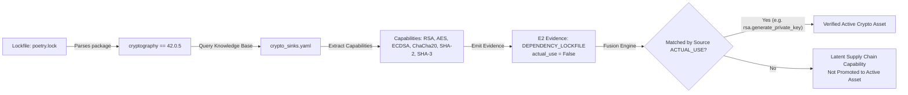

# ECDAT V4 — Cryptographic Dependency Intelligence & Manifest Analysis

## 1. Executive Summary & Research Foundations

Software Bills of Materials (SBOM) and SCA scanners routinely produce thousands of alarms by scanning declared dependencies in lockfiles and manifests. If a project declares `cryptography`, `bouncycastle`, or `openssl`, conventional scanners immediately log hundreds of algorithms as "in-use vulnerabilities".

ECDAT V4 establishes a strict boundary between dependency presence and cryptographic execution:
$$\text{DEPENDENCY} \neq \text{ACTUAL\_USE}$$

- **Dependency Declaration**: Indicates that a package capability is *available* in the software supply chain.
- **Evidence Level**:
  - Unpinned Manifest (`requirements.txt`, `package.json`, `pom.xml`): **$E0$ Evidence** (`DEPENDENCY_DECLARATION`).
  - Cryptographically Pinned Lockfile (`poetry.lock`, `package-lock.json`, `Cargo.lock`): **$E2$ Evidence** (`DEPENDENCY_LOCKFILE`).
- **Cryptographic Asset Creation**: Declared dependencies **DO NOT** create active cryptographic algorithm assets unless corroborating `ACTUAL_USE` ($E1$), binary symbol ($E3$), or runtime handshake ($E4$) evidence is fused by the Evidence Fusion Engine.

---

## 2. Supported Manifest and Lockfile Formats

ECDAT V4 parses manifests and lockfiles across 5 major software ecosystems without executing external shell commands or untrusted build scripts:

| Ecosystem | Direct Manifest | Pinned Lockfile | Extraction Method |
| :--- | :--- | :--- | :--- |
| **Python** | `requirements.txt`, `pyproject.toml` | `poetry.lock` | Standard regex & TOML parsing |
| **Node.js** | `package.json` | `package-lock.json`, `yarn.lock` | JSON AST & Yarn lockfile block parser |
| **Java** | `pom.xml`, `build.gradle` | — | XML DOM parsing & Gradle dependency regex |
| **Go** | `go.mod` | `go.sum` | Go module syntax & checksum verification parser |
| **Rust** | `Cargo.toml` | `Cargo.lock` | TOML deserialization |

---

## 3. Cryptographic Capability Mapping

When a known cryptographic library is detected in a dependency manifest or lockfile, ECDAT V4 maps the package to its documented cryptographic capabilities via `backend/knowledge/crypto_sinks.yaml`.

### Known Capability Mapping Table

| Library / Package | Ecosystem | Primary Capabilities | Default PQC Vulnerability Scope |
| :--- | :--- | :--- | :--- |
| `cryptography` | Python | `RSA`, `AES`, `ECDSA`, `ChaCha20`, `SHA256`, `Ed25519` | Classical asymmetric (Shor-vulnerable) |
| `pycryptodome` | Python | `RSA`, `AES`, `DES`, `ARC4`, `Blowfish`, `SHA1` | Classical asymmetric & legacy symmetric |
| `bouncycastle` | Java | `RSA`, `ECDSA`, `Kyber`, `Dilithium`, `AES-GCM` | Hybrid / Classical / PQC available |
| `jsonwebtoken` / `jose` | Node.js | `RS256`, `ES256`, `HS256`, `EdDSA` | Digital Signatures |
| `golang.org/x/crypto` | Go | `SSH`, `ChaCha20Poly1305`, `Curve25519`, `Argon2` | KDF / Symmetric / Classical |
| `ring` / `rustls` | Rust | `TLS 1.2/1.3`, `ECDHE`, `RSA`, `ChaCha20` | Transport security / Classical primitives |

---

## 4. Direct vs. Transitive Dependencies

1. **Direct Dependencies**:
   - Explicitly declared in top-level manifests (`dependencies`, `devDependencies`, `[tool.poetry.dependencies]`).
   - Flagged with `is_direct = True`.
   - Modifying or migrating these libraries is directly within developer control.
2. **Transitive Dependencies**:
   - Ingested via resolved dependency trees in lockfiles (`package-lock.json`, `poetry.lock`, `Cargo.lock`).
   - Flagged with `is_direct = False`.
   - Modifying transitive dependencies requires upstream coordination, dependency overrides, or framework updates.

---

## 5. Security & Isolation in Dependency Parsing

Package manifest parsing presents potential security vectors (e.g., XML External Entity attacks in `pom.xml`, arbitrary code execution in `setup.py`, or prototype pollution in `package.json`).

ECDAT V4 guarantees:
- **No Build Execution**: Never executes `npm install`, `pip install`, `mvn compile`, or `cargo build`.
- **Safe Parsers**:
  - XML parsing uses `defusedxml` or hardened `xml.etree.ElementTree` with disabled external entities.
  - JSON and TOML parsing use pure-Python native libraries without script execution.
- **Resource Constraints**: Parsing operations run within the P0 Execution Sandbox with CPU timeouts (10s) and bounded memory usage.
