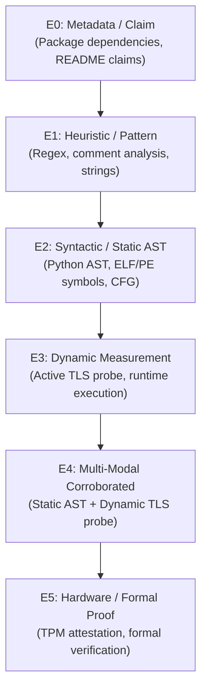

# ECDAT V4 — Evidence Model Specification

## 1. Core Philosophy: Evidence Level vs. Confidence

In cryptographic discovery, **confidence** (the probability or certainty of an observation) is mathematically and conceptually distinct from **evidence level** (the epistemological rigor and observability tier of the measurement).

$$\text{Confidence} \in [0.0, 1.0] \quad \not\equiv \quad \text{Evidence Level} \in \{E_0, E_1, E_2, E_3, E_4, E_5\}$$

- A regex pattern match may have **0.95 confidence** that a string contains `"AES-128-GCM"` in a comment, but its **evidence level is $E_1$ (Heuristic)** because comments do not prove execution or code binding.
- A single active TLS handshake probe verifying a negotiated ML-KEM hybrid key share is **$E_3$ (Dynamic Measurement)**, even if network jitter bounds the probe confidence to **0.85**.
- An asset verified by both an AST call graph ($E_2$) and a live runtime handshake ($E_3$) is promoted to **$E_4$ (Corroborated)** with combined confidence:
$$C_{\text{fused}} = 1 - \prod_{i=1}^n (1 - C_i)$$

---

## 2. Evidence States (`EvidenceState`)

| State | Definition | Example Trigger |
| :--- | :--- | :--- |
| `UNVERIFIED` | Declared in documentation, README, or package manifest without observed execution | `package.json` mentions `crypto-js` |
| `HEURISTIC` | Pattern-based heuristic, string literal regex match, or comment inference | Regex pattern `r"(?i)AES-(?:128\|256)-GCM"` |
| `STATIC_OBSERVED` | Syntactically verified abstract syntax tree (AST) call or binary symbol table entry | `hashlib.sha256()` AST `Call` node or ELF `.dynsym` |
| `DYNAMIC_OBSERVED` | Actively probed at runtime over network, IPC, or debugger instrumentation | TLS 1.3 `ClientHello` / `ServerHello` handshake probe |
| `HARDWARE_ATTESTED` | Cryptographic proof from HSM, TPM 2.0, or secure enclave quote | TPM quote or PKCS#11 token attestation |
| `CORROBORATED` | Independent cross-modal agreement across two or more disjoint observation types | Static AST call corroborated by live TLS negotiation |
| `CONTRADICTED` | Conflicting observations across modalities for the same asset parameter | Code configures RSA-4096, but network negotiation uses RSA-2048 |

---

## 3. Evidence Levels Hierarchy (`EvidenceLevel`)

The evidence levels define a monotonic ranking ($E_0 < E_1 < E_2 < E_3 < E_4 < E_5$):



### Rank Mapping
```python
LEVEL_RANK = {
    EvidenceLevel.E0_METADATA: 0,
    EvidenceLevel.E1_HEURISTIC: 1,
    EvidenceLevel.E2_SYNTACTIC: 2,
    EvidenceLevel.E3_DYNAMIC: 3,
    EvidenceLevel.E4_CORROBORATED: 4,
    EvidenceLevel.E5_FORMAL: 5,
}
```

---

## 4. Provenance Record (`Provenance`)

Every piece of evidence emitted in ECDAT V4 **must** preserve tamper-evident provenance back to the raw source:

```json
{
  "source_tool": "ast_scanner",
  "source_file": "backend/crypto_service.py",
  "line_start": 42,
  "line_end": 44,
  "byte_offset": 1280,
  "timestamp": "2026-09-17T12:00:00.000000Z",
  "sha256_context": "a1b2c3d4e5f6...",
  "extractor_version": "4.0.0"
}
```

### Required Fields
- `source_tool`: Identifier of the extractor (e.g., `ast_scanner`, `binary_inspector`, `network_prober`).
- `source_file`: Relative file path or network URI.
- `line_start` & `line_end`: 1-based source line numbers (optional for binaries/network).
- `byte_offset`: Offset into binary or source stream.
- `timestamp`: UTC ISO-8601 string.
- `sha256_context`: SHA-256 hash of the enclosing code block, packet, or section.
- `extractor_version`: Version of the scanner module that generated the observation.

---

## 5. Formal Evidence JSON Schema

```json
{
  "id": "evi-9f8a7b6c5d4e",
  "asset_id": "asset-sha256-aes256gcm",
  "state": "static_observed",
  "level": "E2",
  "observation_type": "ast_call",
  "confidence": 0.95,
  "provenance": {
    "source_tool": "ast_scanner",
    "source_file": "app/crypto.py",
    "line_start": 18,
    "line_end": 18,
    "byte_offset": 450,
    "timestamp": "2026-09-17T12:00:00Z",
    "sha256_context": "e3b0c44298fc1c149afbf4c8996fb92427ae41e4649b934ca495991b7852b855",
    "extractor_version": "4.0.0"
  },
  "raw_payload": {
    "module": "cryptography.hazmat.primitives.ciphers.aead",
    "class": "AESGCM",
    "key_size_bits": 256
  },
  "scan_id": "scan-1726574400-abcd",
  "created_at": "2026-09-17T12:00:00Z"
}
```
