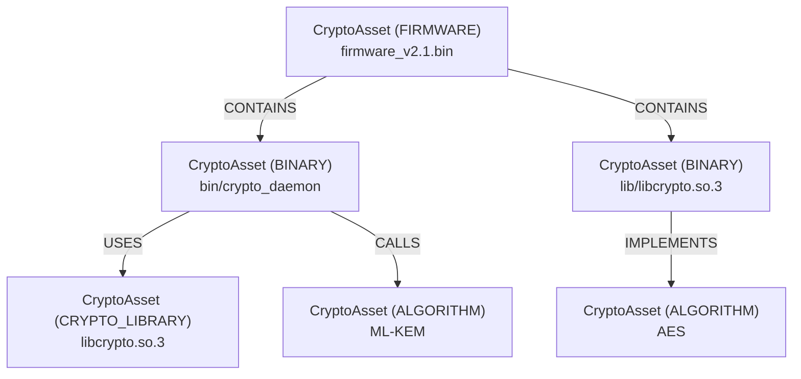

# ECDAT V4 — Firmware Analysis & Container Extraction

## 1. Scope & Capabilities

The **ECDAT V4 Firmware Analysis Engine** processes embedded system images, IoT firmware containers, and compressed archive filesystems without requiring external native unpackers:

| Container Format | Magic Signature | Parsing Implementation |
| :--- | :--- | :--- |
| **U-Boot uImage** | `0x27051956` | Pure-Python header parser (recovers OS, architecture, payload offset, image size). |
| **Flattened Image Tree (FIT / DTB)** | `0xd00dfeed` | Device Tree Blob header detection and payload bounds. |
| **SquashFS** | `hsqs`, `sqsh`, `qshs`, `shsq` | Header detection (little and big-endian) and filesystem parameter identification. |
| **CPIO Archive** | `070701`, `070702`, `070707` | Streaming ASCII header parser unpacking embedded Linux initramfs rootfs entries. |
| **ZIP Archive** | `PK\x03\x04` | Built-in `zipfile` engine with bounded size verification. |
| **POSIX Tar** | `ustar` at 257 | Pure-Python `tarfile` streaming extractor. |
| **Gzip Compressed Stream** | `\x1f\x8b` | Single-pass decompressor for compressed kernel and filesystem images. |
| **Raw Monolithic Blob** | Arbitrary | Entropy-distribution mapped binary inspection. |

---

## 2. Sandbox Security Constraints & Resource Bounds

Firmware extraction is constrained by hard security bounds to prevent resource exhaustion, denial-of-service, and host filesystem contamination:

```
[Uploaded Container] (Max 8 MiB)
         │
         ▼
[FirmwareExtractor]
  ├── Max Recursion Depth: 3
  ├── Max Cumulative Files: 200
  ├── Max Total Decompressed Bytes: 16 MiB
  ├── Max Per-File Size: 8 MiB
  ├── Path Traversal Check: Reject "..", "/", "\0"
  ├── Cyclic Archive Loop Check: Visited SHA-256 Hash Set
  └── In-Memory Processing: 0 temporary disk writes
         │
         ▼
[Extracted Leaf Binaries & Filesystems]
```

### 2.1 Defense Against Malicious Payloads
1. **Directory Traversal**: File entries containing relative path traversal components (`../../etc/shadow`), leading slashes, or embedded null bytes are automatically dropped with an explanatory security error.
2. **Decompression Bombs (Zip-Bombs)**: Both declared uncompressed sizes and actively decompressed stream lengths are tracked cumulatively. If the cumulative decompressed size exceeds 16 MiB or a single entry exceeds 8 MiB, extraction immediately aborts with `ValueError("Expanded archive exceeds 8 MiB")`.
3. **Encrypted Archives**: Password-protected or encrypted ZIP entries are rejected immediately (`ValueError("Encrypted ZIP entries are unsupported")`).
4. **Archive Bomb Cycles**: Archives containing duplicate or circular nested containers are detected via an in-memory hash set of unpacked blobs.

---

## 3. Containment Hierarchy & Graph Relationships

When a firmware package is processed, the discovery pipeline establishes a typed hierarchical graph inside the **ECDAT Relational Asset Graph**:



### Relational Properties
- **Container Node**: Represents the root firmware image (`AssetType.FIRMWARE`), tracking the overall firmware SHA-256, packaging format, and total member count.
- **Member Nodes**: Each unpacked executable or library becomes an individual `CryptoAsset` of type `AssetType.BINARY`.
- **Relationship Type**: `RelationshipType.CONTAINS` links the firmware container to its extracted member files.
- **Multi-Hop Traversal**: Upstream queries to determine blast radius correctly traverse from compromised cryptographic algorithms (e.g. vulnerable RSA or DES S-box) up to the containing binary and parent firmware container.
