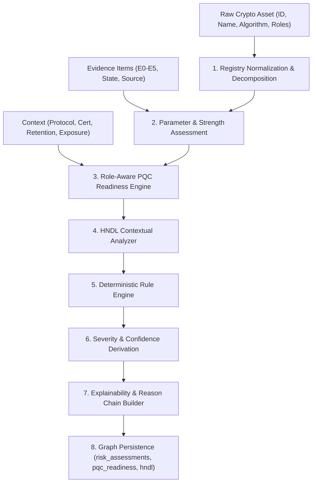

# ECDAT V4 — P2.1 Architecture & Pipeline Design
## Crypto Risk Intelligence & PQC Readiness Subsystem

### 1. Architectural Scope
The P2.1 Intelligence layer operates directly on top of:
- **P0 Evidence Model & Persistent Asset Graph** (`backend/engine/asset_graph.py`)
- **P1.1 Source & Dependency Analyzers** (`backend/engine/static_analyzer.py`, `dependency_scanner.py`)
- **P1.2 Binary & Firmware Analyzers** (`backend/engine/binary/`)
- **P1.3 Network Intelligence Engine** (`backend/engine/network/`)

It synthesizes heterogeneous, multi-horizon observations into deterministic, explainable risk assessments and post-quantum migration roadmaps without speculative hallucinations or opaque numerical scores.

---

### 2. Component Layout (`backend/engine/intelligence/`)

```
backend/engine/intelligence/
├── models.py                     # Strict typing: Enums, Dataclasses, Schemas
├── algorithm_registry.py         # Knowledge-base backed canonical normalization & hybrid resolver
├── security_strength.py          # Parameter-aware classical & quantum bit strength analyzer
├── evidence_context.py           # Evidence fusion mapper (E0-E5, State -> Confidence)
├── risk_engine.py                # Deterministic rule evaluator (LEG, PQ, TLS, CERT, HNDL, UNK)
├── pqc_readiness.py              # Role-aware PQC readiness assessment
├── hndl_analyzer.py              # Harvest-Now-Decrypt-Later confidentiality risk analyzer
├── protocol_risk.py              # TLS / SSH protocol configuration risk evaluator
├── certificate_risk.py           # X.509 certificate trust, validity, & signature evaluator
├── explainability.py             # Machine-readable reason chain generator
└── intelligence_pipeline.py      # Master pipeline orchestrator & facade
```

---

### 3. End-to-End Pipeline Data Flow



---

### 4. Key Axioms Enforced in Code

1. **Evidence Traceability**: No risk finding is generated without linking to concrete evidence ($E0$–$E5$) or an explicit note of limitation when inferred purely from algorithm names.
2. **Distinct Concepts**:
   - $SUPPORTED \ne ADVERTISED \ne OFFERED \ne NEGOTIATED \ne OBSERVED$
   - $SEVERITY \ne CONFIDENCE$
   - $HYBRID\_KEX \ne PQC\_SIGNATURE$
   - $CERTIFICATE\_PRESENT \ne TRUST\_VALIDATED$
   - $SCANNER\_UNAVAILABLE \ne NOT\_SUPPORTED$
3. **No Default Parameters**:
   - If an algorithm's key size is unknown, parameter status is set to `UNKNOWN` and bits are set to `None`, triggering rule `UNK-001`. The engine never assumes 2048-bit RSA or 128-bit AES without evidence.
4. **Context-Guarded HNDL**:
   - If data retention lifetime or sensitivity is unknown, HNDL state resolves to `HNDL_UNKNOWN` with registered `UnknownFactor` records, preventing unwarranted alarm or false confidence.
