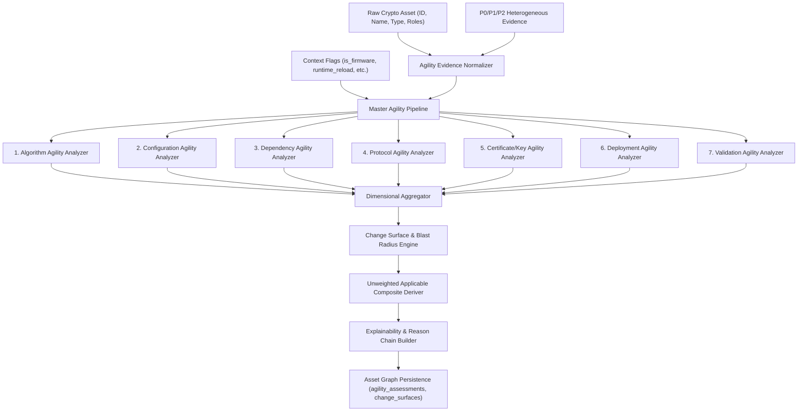

# ECDAT V4 — P2.2 Architecture & Pipeline Design
## Crypto-Agility Intelligence Subsystem

### 1. Architectural Scope & Mission
P2.2 addresses the fundamental research question:
> *"Can crypto-agility be measured from observable architectural and implementation evidence rather than from a manually assigned score?"*

Unlike legacy scalar score generators, the P2.2 Crypto-Agility Intelligence Engine is an evidence-grounded, multi-dimensional evaluation subsystem built cleanly on top of:
- **P0 Evidence Model & Persistent Asset Graph** (`backend/engine/asset_graph.py`, `backend/engine/evidence/`)
- **P1.1 Source & Dependency Analyzers** (`backend/engine/static_analyzer.py`, `backend/engine/dependency_scanner.py`)
- **P1.2 Binary & Firmware Analyzers** (`backend/engine/binary/`)
- **P1.3 Network Intelligence Engine** (`backend/engine/network/`)
- **P2.1 Crypto Risk & PQC Readiness Engine** (`backend/engine/intelligence/`)

The existing legacy agility engine (`backend/engine/agility_engine.py`) and legacy endpoint (`POST /api/agility/evaluate`) remain **100% untouched and backward compatible**. P2.2 is purely additive.

---

### 2. Component Layout (`backend/engine/agility/`)

```
backend/engine/agility/
├── models.py                     # Strongly typed Enums (AgilityDimension, AgilityState, AgilityConfidence, ChangeComplexity) & Dataclasses
├── evidence.py                   # Normalization adapter mapping P0/P1 observations to agility evidence items with keyword token matching
├── rules_engine.py               # Deterministic rule evaluator loading rules from crypto_agility_rules.yaml
├── dimensions/                   # Independent 7-dimensional analyzers
│   ├── algorithm_agility.py      # D1: Provider abstraction, dynamic dispatch vs. hardcoded direct calls
│   ├── configuration_agility.py  # D2: Externalized configuration, env vars vs. hardcoded keys/parameters
│   ├── dependency_agility.py     # D3: Pluggable package managers, dynamic linking vs. static vendoring
│   ├── protocol_agility.py       # D4: Dynamic protocol negotiation, cipher suites vs. fixed/pinned protocols
│   ├── certificate_agility.py    # D5: Automated rotation (ACME, cert-manager) vs. embedded static certs
│   ├── deployment_agility.py     # D6: Containers, microservices, dynamic reload vs. immutable bare-metal/firmware
│   └── validation_agility.py     # D7: Cryptographic test suites (Wycheproof, KAT, CAVP) vs. absent test verification
├── change_surface.py             # Multi-hop blast radius footprint extractor & complexity solver
├── explainability.py             # Machine-readable reason chain and provenance generator
└── agility_pipeline.py           # Master coordinator, composite score derivation, hash generator, and persistence facade
```

---

### 3. Seven Independent Agility Dimensions

Agility is not a single scalar metric. An asset can have high protocol agility (negotiating TLS 1.2 and 1.3 dynamically) but low algorithm agility (hardcoded calls to RSA-2048 in its core cryptographic service).

1. **Algorithm Agility (`ALGORITHM`)**: Evaluates whether algorithms are invoked via provider abstractions (e.g. OpenSSL EVP, JCA/JCE `Cipher.getInstance`, PKCS#11) or hardcoded direct primitive invocations (`AES_encrypt`, `DES_ede3_cbc_encrypt`).
2. **Configuration Agility (`CONFIGURATION`)**: Measures if algorithms, key lengths, and parameters are driven by external configuration files, environment variables, or secret vaults, rather than hardcoded in source.
3. **Dependency Agility (`DEPENDENCY`)**: Evaluates modular package management, dynamic library linking, and pluggable crypto engines versus unversioned, vendored, or static in-tree dependencies.
4. **Protocol Agility (`PROTOCOL`)**: Evaluates runtime protocol negotiation, dynamic cipher suite ordering, and multi-protocol capabilities (applicable to network endpoints and TLS/SSH services).
5. **Certificate / Key Agility (`CERTIFICATE_KEY`)**: Evaluates automated lifecycle management (ACME, cert-manager, external keystores) versus embedded static certificates and hardcoded private keys in binaries or firmware.
6. **Deployment Agility (`DEPLOYMENT`)**: Measures continuous delivery, containerized workload redeployment, and zero-downtime runtime configuration reloads versus immutable bare-metal or monolithic firmware images.
7. **Validation Agility (`VALIDATION`)**: Evaluates the presence and execution of regression suites, Known Answer Tests (KAT), Wycheproof test vectors, and cryptographic validation suites to verify algorithm substitutions safely.

---

### 4. End-to-End Pipeline Data Flow



---

### 5. Architectural Invariants Enforced in Code

1. **Categorical State Primacy**: Evaluated dimensions produce categorical states (`SUPPORTED`, `OBSERVED`, `PARTIALLY_OBSERVED`, `CONSTRAINED`, `BLOCKED`, `UNKNOWN`, `NOT_APPLICABLE`, `SCANNER_UNAVAILABLE`).
2. **Derived Composite Score**: Any numerical composite score is strictly marked `score_type: "DERIVED"` and represents an unweighted mean over applicable, known dimensions. It is never used as the source of truth for agility decisions.
3. **Graph Coupling Independence**: High graph centrality or large blast radius does not imply low agility; it measures change risk and blast radius impact.
4. **Risk Orthogonality**: High cryptographic risk (e.g. quantum vulnerability) does not imply low agility. An asset running RSA-2048 via dynamic EVP provider abstraction has high risk but high agility.
5. **Scanner Unavailability vs Inagility**: If a scanner tool fails or is unavailable, the state is recorded as `SCANNER_UNAVAILABLE` with reason `scanner_unavailable`, never as `BLOCKED` or `CONSTRAINED`.
6. **Contradiction Preservation**: If evidence contains conflicting signals (e.g. dynamic reload observed but static binary indicated), both evidence items and corresponding reasons are preserved in the explainability reason chain.
7. **Historical Immutability**: All assessments and change surface evaluations are written to the database with UUID primary keys and scan timestamps. Existing records are never overwritten.
